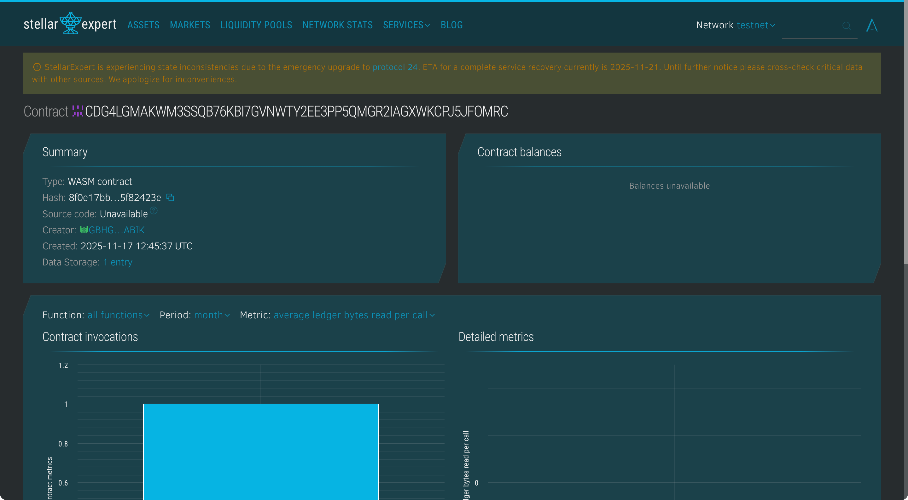

# ProofOfBuild Registry

## Project Title
ProofOfBuild Registry

## Project Description
ProofOfBuild Registry is a blockchain-based project creation and ownership recording platform. Using Soroban smart contracts on Stellar, the registry immutably timestamps and verifies the origin of open source projects, securely binding developers to their created works and providing proof of timely ownership.

## Project Vision
The project aims to solve intellectual property disputes in software development by providing an immutable, transparent proof of project creation and ownership. It empowers developers with a trusted digital ledger for claiming and verifying software authorship, fostering fair recognition and security.

## Key Features
- Immutable Build Records: Timestamp and store project creation details securely.
- Developer Binding: Link developers' wallet addresses with project metadata.
- Verification Mechanism: Authorized parties approve builds to certify authenticity.
- Public Querying: Anyone can view build records and verify ownership.
- Secure Metadata: Include repository URLs and descriptive details in records.
- Tamper-proof Ledger: On-chain data ensures records cannot be falsified.
- Authorization Controls: Developers authenticate submissions securely.

## Usage Instructions
1. Register Build: Developers create entries with project details.
2. Verify Build: Admins or authorized verifiers confirm authenticity.
3. Query Records: Stakeholders access project creation proofs anytime.

## Future Scope
- Multi-factor verification (multisig or decentralized approvers).
- Integration with Git repository platforms for automated registrations.
- Build history tracking and versioning.
- IP protection and licensing functionality.
- On-chain build status and CI/CD integration.
- User interfaces for easier registry access and updates.

## Technology Stack
- Soroban Rust SDK for secure contract execution.
- Stellar blockchain providing transparent and immutable storage.
- Cryptographic signing and authorization mechanisms.

## Contribution
Open for blockchain developers, open source advocates, and legal experts to contribute improvements. Contributions welcome through forks and pull requests.

## License
This project is licensed under the MIT License.

### Contract Detail
ID : CBYR3A37MLRQZP6E5YYUMP2I6ISCBQA2ONGJLXC4K4ECLM2ZTL34AJWV
